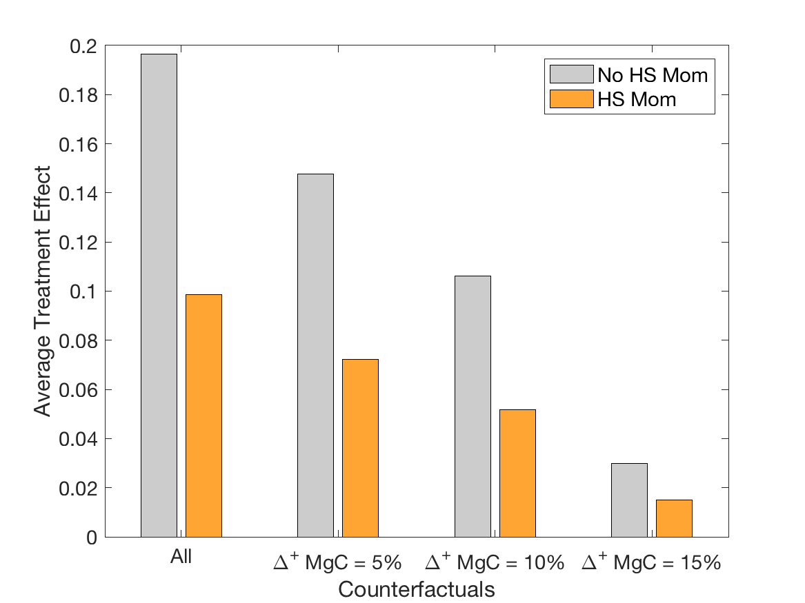
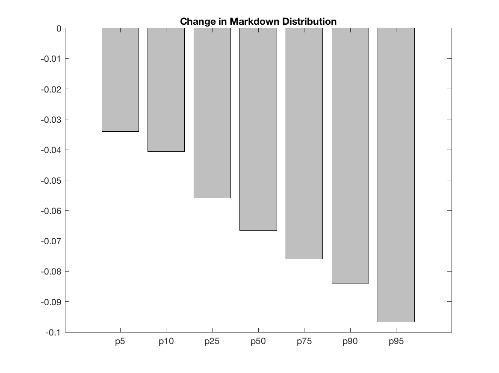
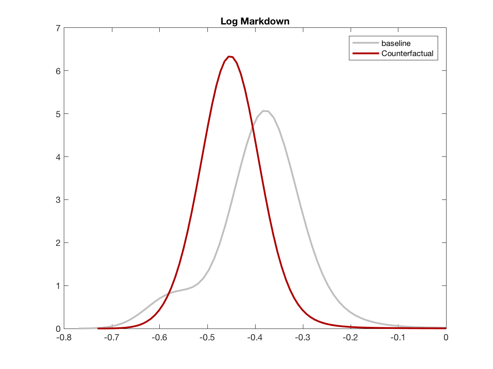
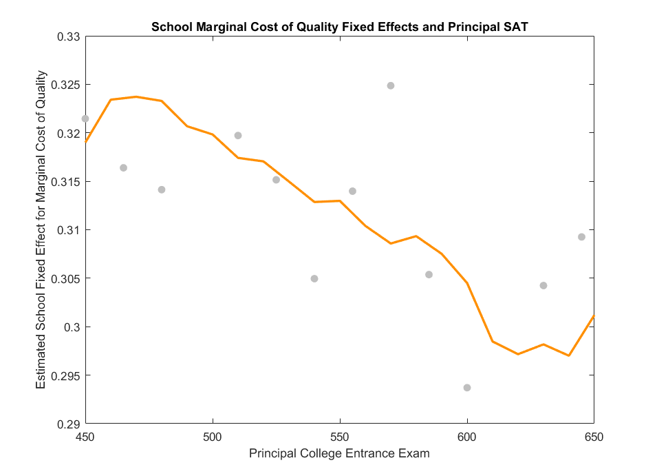

### Paper and Supplemental Documents

[Working Paper](../work/documents/AllendeGallegoNeilson2019/SchoolChoiceInfoExp.pdf)

[Online Appendix](../work/documents/AllendeGallegoNeilson2019/OnlineAppendix_AGN.pdf)

[Schooling Markets Appendix](../work/documents/AllendeGallegoNeilson2019/OnlineAppendix_SchoolingMarketsChile.pdf)

### Graphs From the Paper

  

    

      

        

          

            
          

          

            
          

          

            
          

          

            
          
      
          

            
          
  
          

            
          
                 
        

      

    

  

<!-- **Distribution of Cost Estimates**

**Counterfactual Distribution of School Value Added with Supply and Demand Reaction**

 -->
