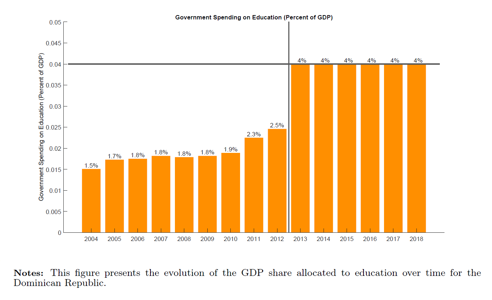
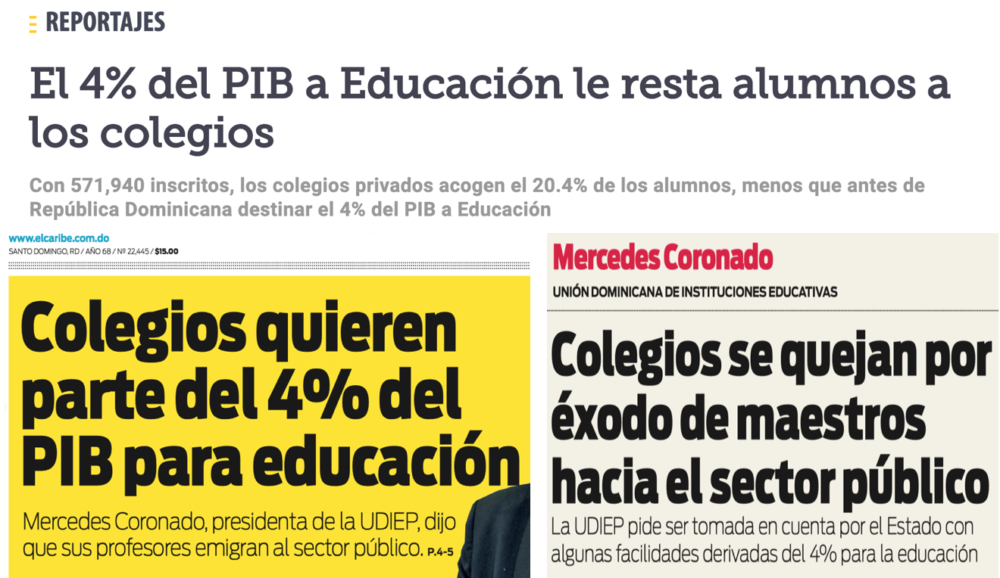
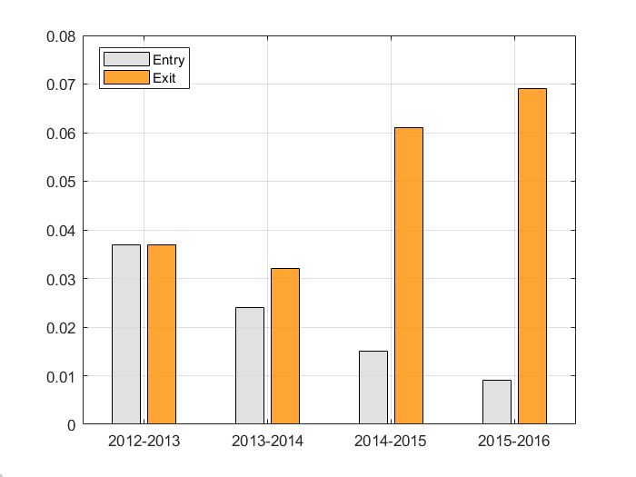
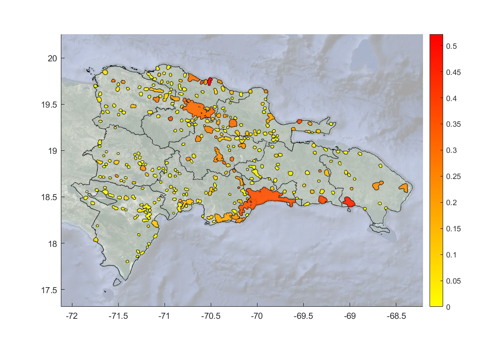
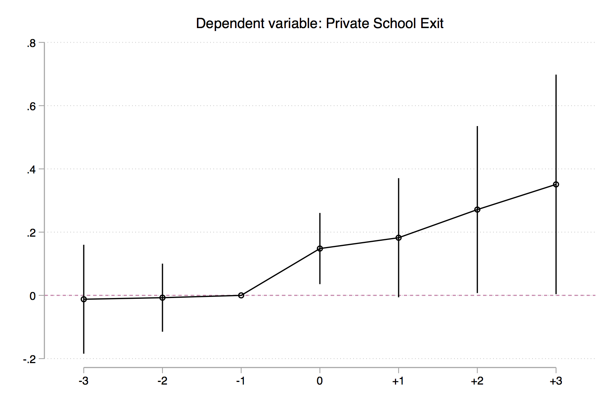
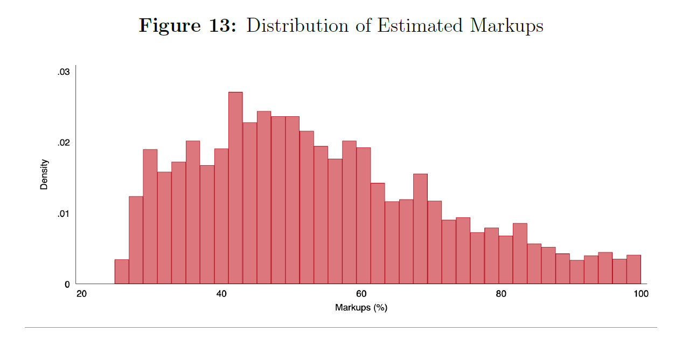
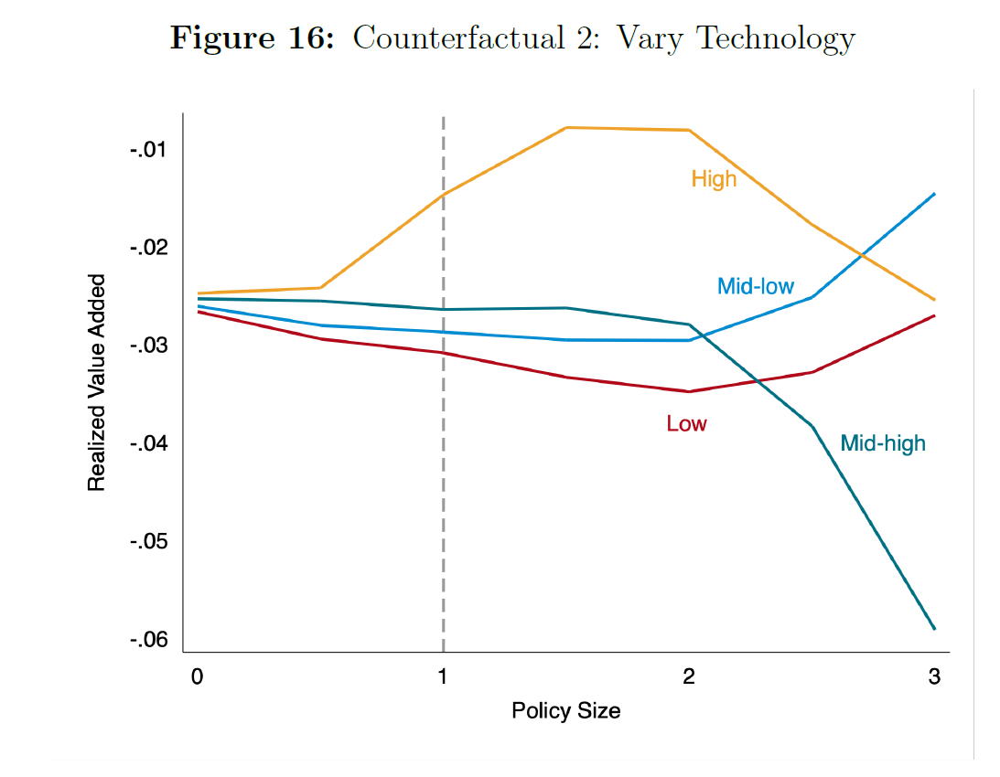
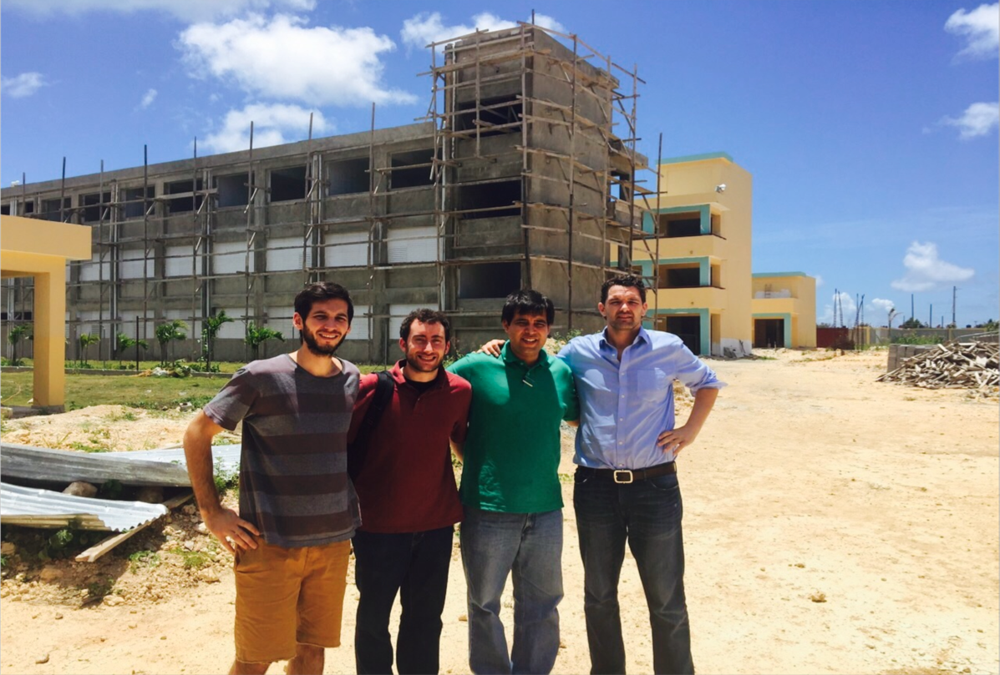

### Current Draft

[Working Paper](../work/documents/SchoolConstructionGE/DNO_Nov_2020_WP.pdf)

### Graphs From the Paper

 

   

     

       

         

           
         

         

           
         
               
         

           
         
   
         

           
         
                      
         

           
         
         
         

           
         

         

           
         

         

           
         
                             
       

     

   

 

