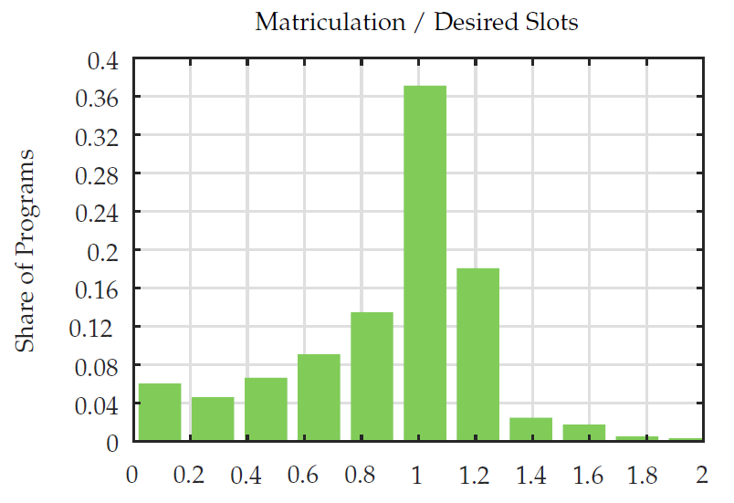

### Figures From the Paper

  

    

      

        

        

          
        

        

          
        

          

            
          

          

            
          

          

            
          
  
          

            
          
  
          

            
          

          

            
          
         
          

            
          
   
          

            
          
  
          

            
          
      
          

            
          
       
          

            
          
    
          

            
          
      
          

            
          
                  
        

      

    

  

