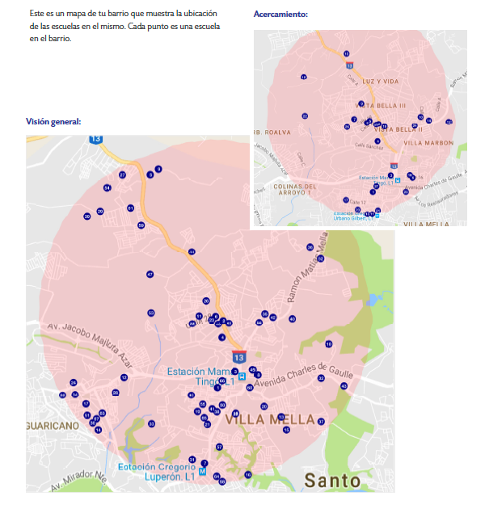

### Graphs From the Paper

  

    

      

        

        

          
         
  
          

            
          

          

            
          

          

            
          

          

            
          
      
          

            
          
  
          

            
          
           
          

            
          
  
          

            
          
                
        

      

    

  

