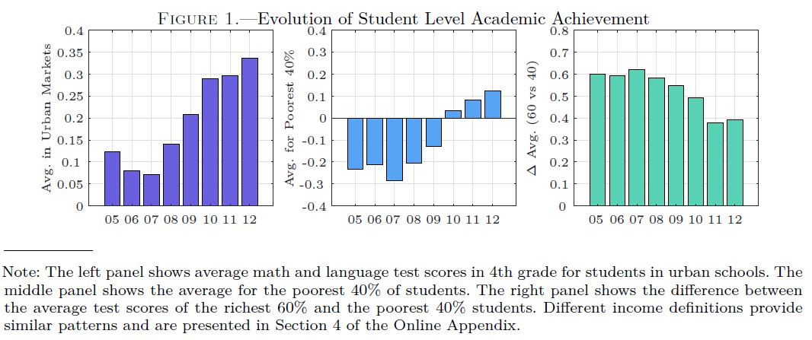
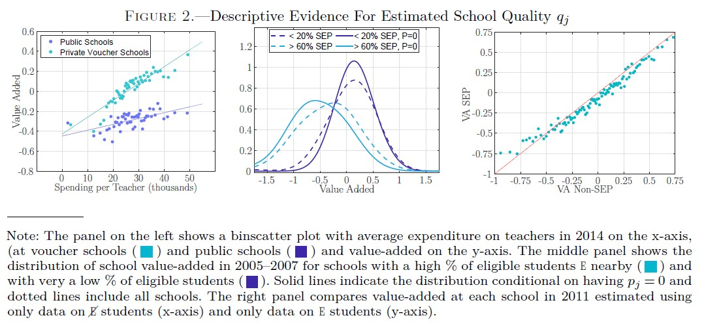
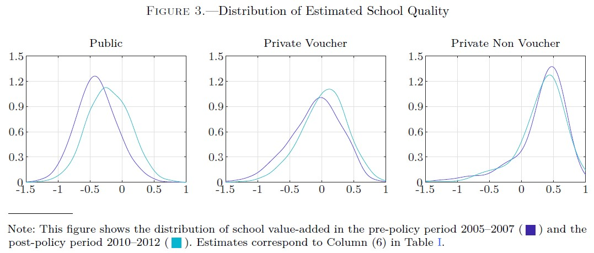
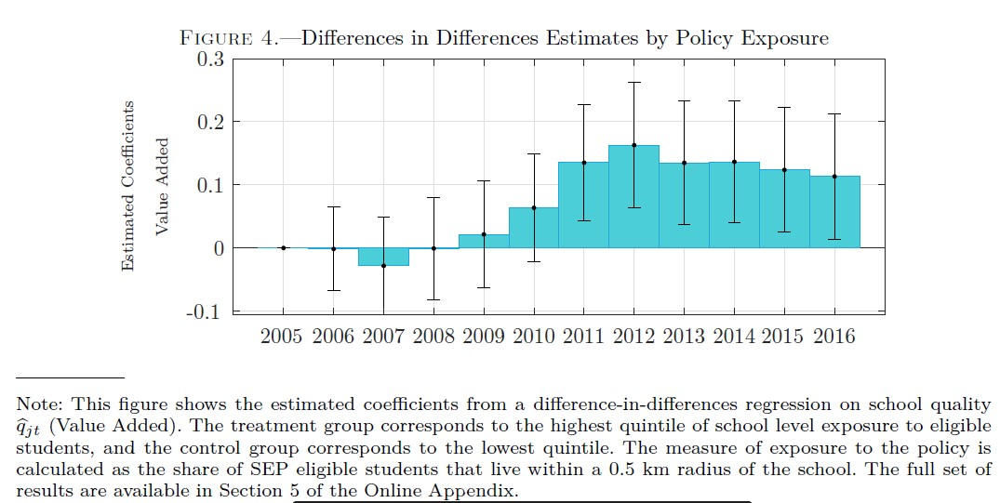
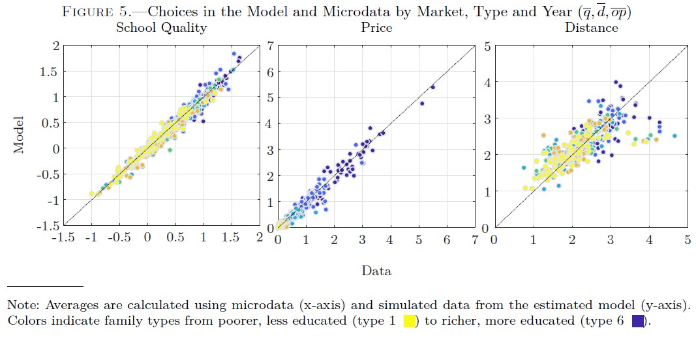
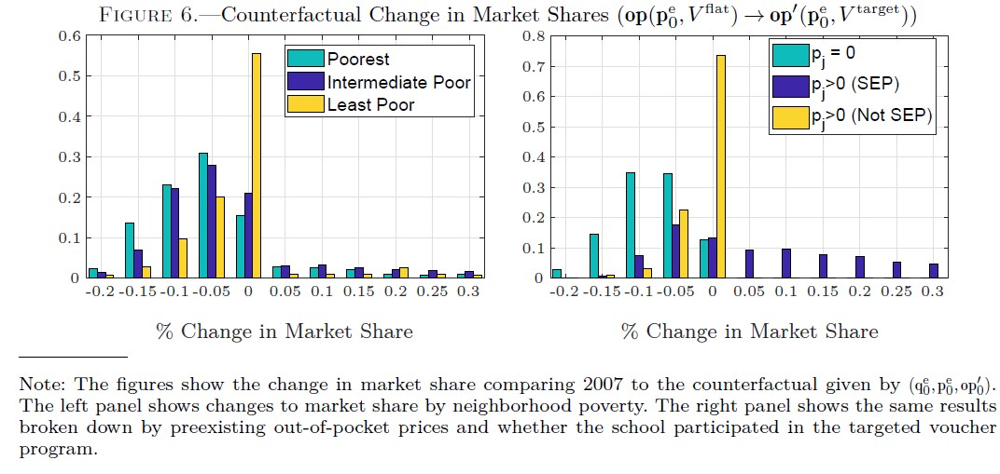

### Current Working Paper (under review at Econometrica)

[Most Current Working Paper - May 2021](../work/documents/Neilson_JMP/Neilson_SEPVouchers2021.pdf)

[Most Current Online Appendix - May 2021](../work/documents/Neilson_JMP/OnlineAppendix_2021.pdf)

### Supplements to Online Appendix

[Supplement on Defining Schooling Markets  - May 2021](../work/documents/Neilson_JMP/Appendix_ChileSchoolingMarkets.pdf)

[Supplement on School Spending - May 2021](../work/documents/Neilson_JMP/Supplement_Expenditures.pdf)

[Supplement on School Income - May 2021](../work/documents/Neilson_JMP/Supplement_Incomes.pdf)

[Supplement on School Value Added - May 2021](../work/documents/Neilson_JMP/Supplement_ValueAdded.pdf)

[Supplement on Voucher Rules - May 2021](../work/documents/Neilson_JMP/Supplement_VoucherRules.pdf)

### Graphs From the Paper

  

    

      

        

          

            
          

          

            
          

          

            
          

          

            
          

          

            
          

          

            
          

        

      

    

  

<!-- ### Older versions of the paper   -->
