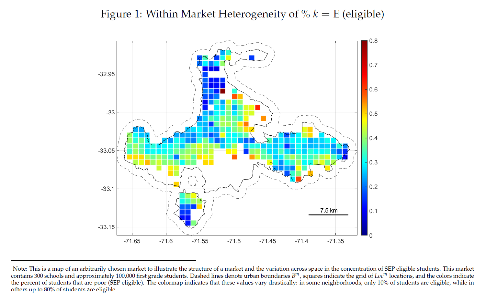
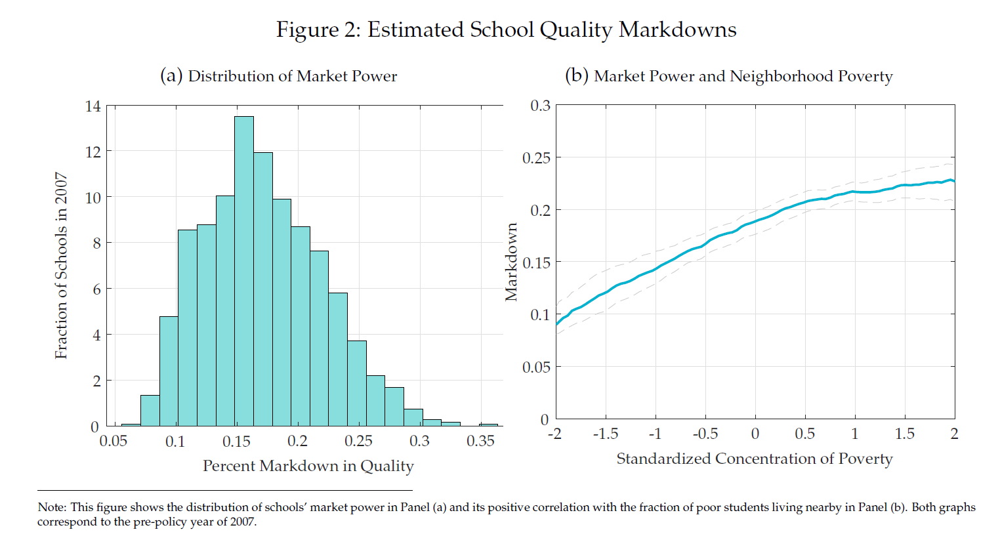
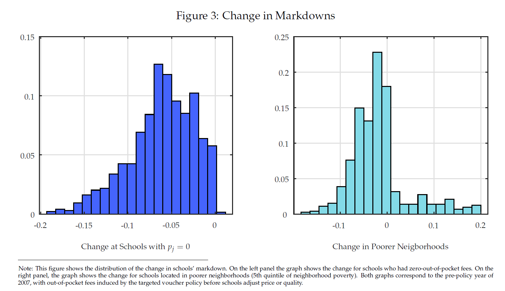
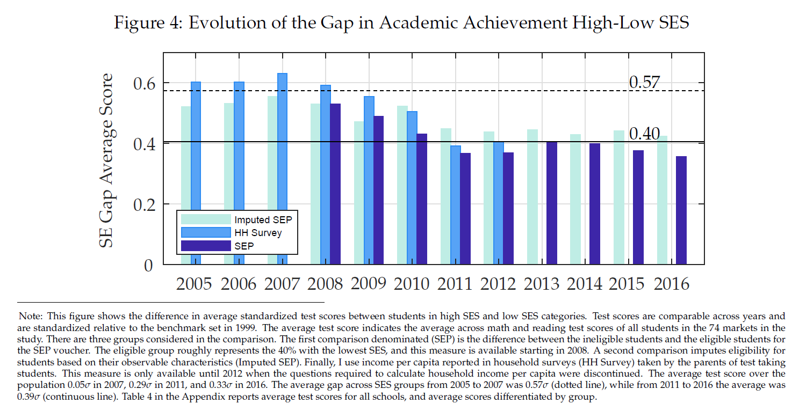
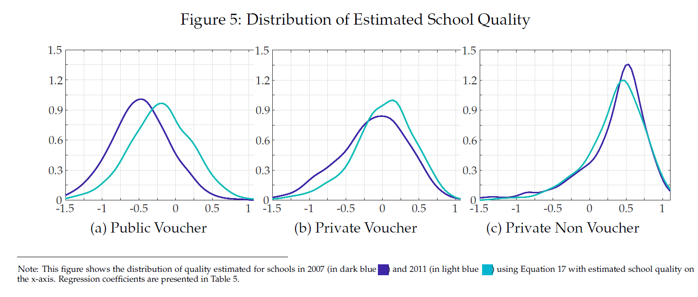
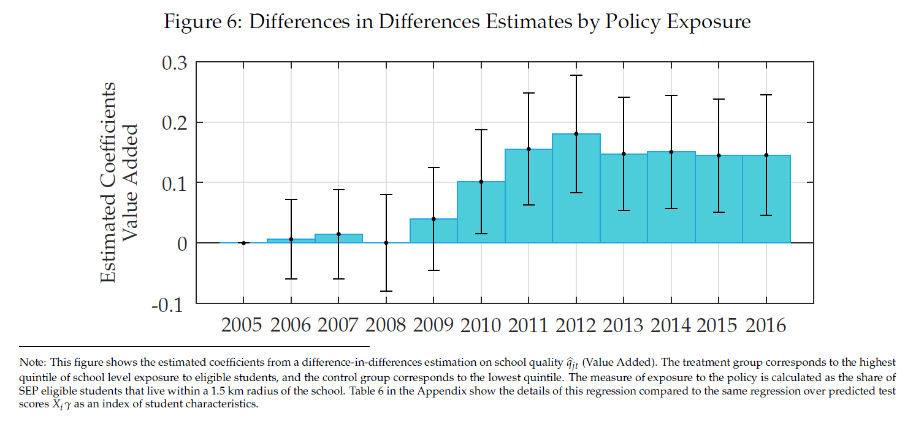

### Current Working Paper (under review at Econometrica)

[Most Current Working Paper - March 2020](../work/documents/Neilson_JMP/Neilson_SEPVouchers2020.pdf)

[Most Current Online Appendix](../work/documents/Neilson_JMP/OnlineAppendix_reducido.pdf)

[Supplement on Defining Schooling Markets](../work/documents/Neilson_JMP/Appendix_ChileSchoolingMarkets.pdf)

[Supplement on School Spending](../work/documents/Neilson_JMP/Supplement_Expenditures.pdf)

[Supplement on School Income](../work/documents/Neilson_JMP/Supplement_Incomes.pdf)

[Supplement on School Value Added](../work/documents/Neilson_JMP/Supplement_ValueAdded.pdf)

[Supplement on Voucher Rules](../work/documents/Neilson_JMP/Supplement_VoucherRules.pdf)

### Graphs From the Paper

  

    

      

        

          

            
          

          

            
          

          

            
          

          

            
          
   
          

            
          
  
          

            
          
               
        

      

    

  

<!-- ### Older versions of the paper   -->
