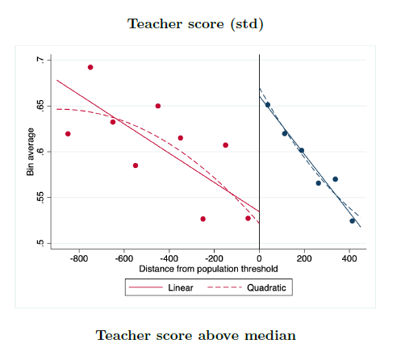

[Working Paper](../work/documents/TeacherSchoolChoice/BELNN_March_2021.pdf)

### Figures From the Paper

  

    

      

        

          

            
          

          

            
          

          

            
          

          

            
          

          

            
          

          

            
          

          

            
          

          

            
          

          

            
          

          

        

      

    

  

  #### Notes
  A prior working paper studying the same policy is titled *Teacher Wages, Student Achievement and the Recruitment of Talent in Rural Peru*
