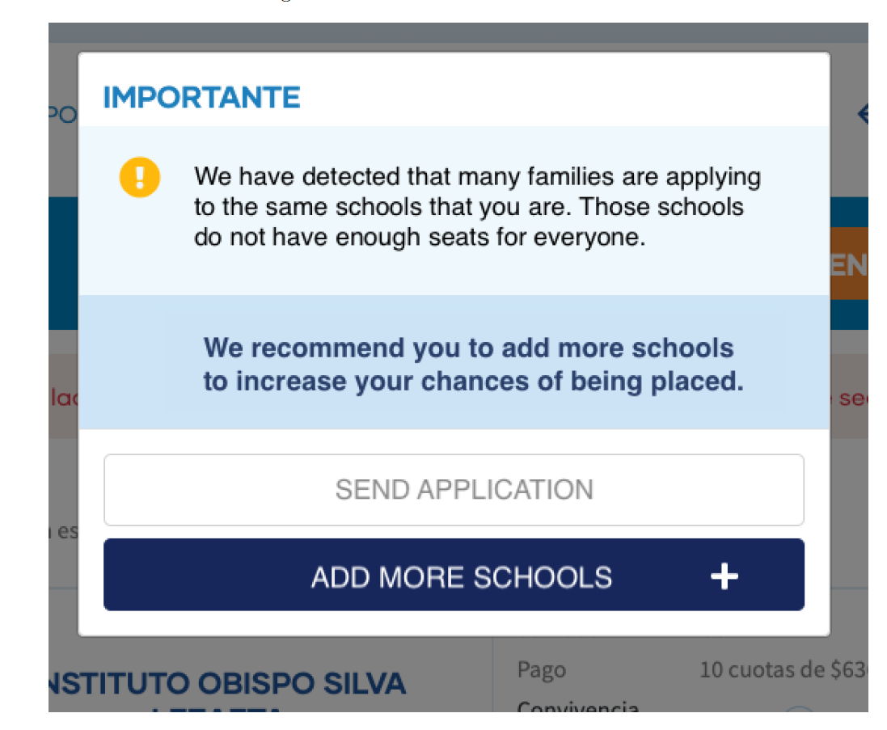
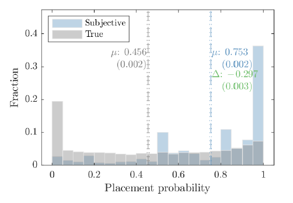
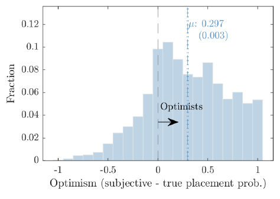
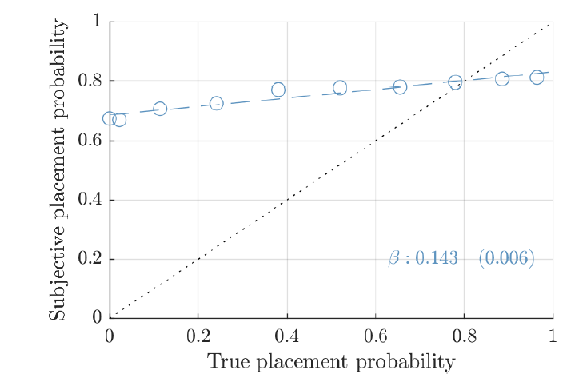
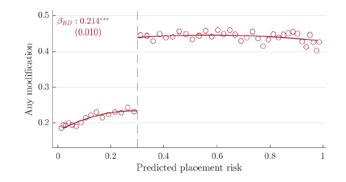
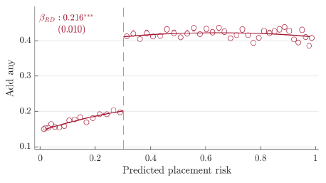
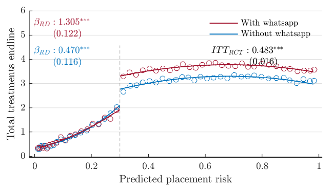

### Current Draft

[Most Current Working Paper - March 2021](../work/documents/Warnings/AKNZ_March2021.pdf)

[Most Current Online Appendix](../work/documents/Warnings/OnlineAppendix.pdf)

### Implementation in Chile

### Implementation in New Haven, CT

### Graphs From the Paper

  

    

      

        

        

          
        

        

          
        

          

            
          

          

            
          

          

            
          

          

            
          

          

            
          

        

      

    

  

